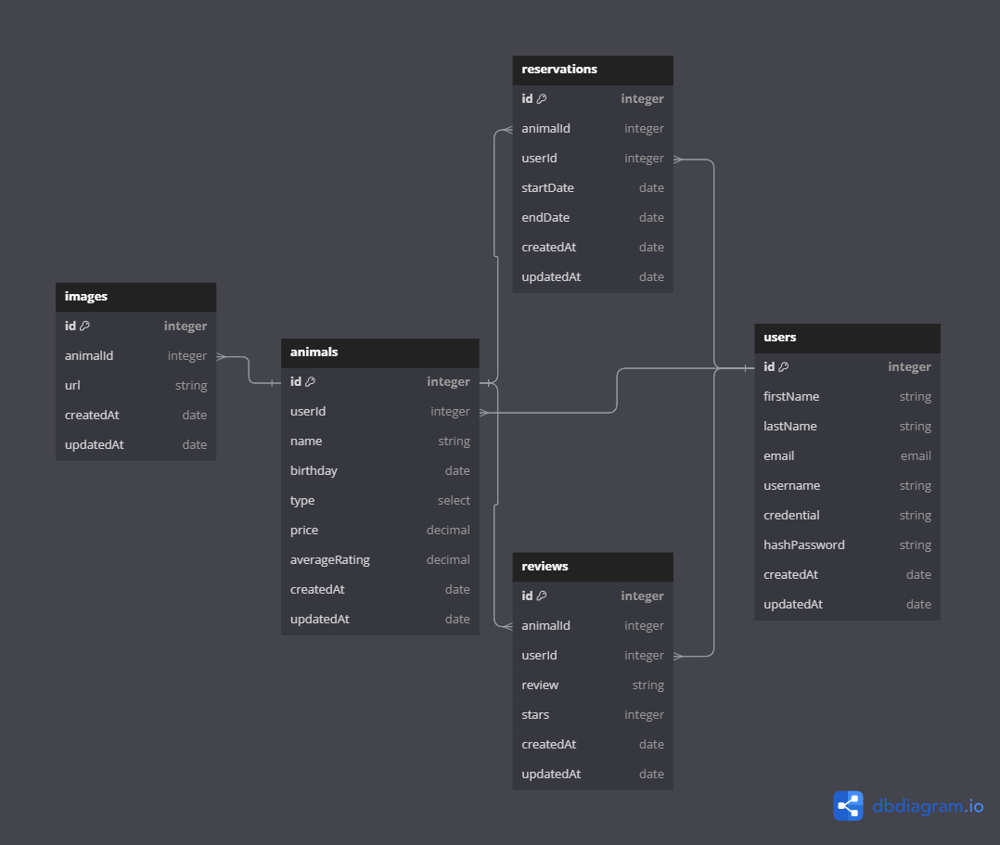

# RentAPet

Your partner leaving for the weekend and you need a temporary furry cuddle buddy? Or are you preparing for the perfect beach family photo but missing the one special feeling a dog, or iguana, or even a cheetah could bring to the picture? This is the site for you!

If you're too busy living your life and like the idea of owning a pet but just can't seem to find the time; or better yet, know that you just can't be bothered with a lifetime commitment of caring for another living thing we at Rent A Pet commend you for knowing yourself and we are here to help!

Just browse through the listings of people who are sharing their pets with someone just like you. Find the perfect temporary buddy to fill a void or gap in your life and then when you're feeling fufilled just return the pet to it's loving home.

Coming soon: full reviews of pets once they have been borrowed.

## Frontend

JSX, React, and Redux

## Backend

Express, Sequelize, PostgreSQL, and Render

## Some views of the site

COMING SOON!!!

## Database Schema Design

## Routes
each route should be proceeded with `/api`

### User Authentication and Authorization
* `/users/:id` 'GET' returns the current user info
* `/users/login` 'POST' logs in a current user
* `/users/signup` 'POST' creates a new user, logs them in as the current user, and returns the current user's info

### Animals
* `/animals` 'GET' returns all animals
* `/user/:userId/animals` 'GET' returns all of the animals created by the current user
* `/animals/:id` 'GET' returns the details of an animal
* `/animals` 'POST' creates and returns a new animal
* `/animals/:animalId/images` 'POST' creates and returns a new image for an animal based on their id
* `/animals/:id` 'PUT' updates and returns an existing animal
* `/animals/:id` 'DELETE' deletes an existing animal

### Reservations
* `/users/:userId/reservations` 'GET' return all reservations that a current user has made
* `/animals/:animalId/reservations` 'GET' return all reservations for an animal based on the animal id
* `/users/:userId/reservations` 'POST' create and return a new reservation for an animal specified by id
* `/reservations/:id` 'PUT' update and return an existing reservation
* `/reservations/:id` 'DELETE delete an existing reservation

### Reviews
* `/users/:userId/reviews` 'GET' return all reviews written by the current user
* `/animals/:animalId/reviews` 'GET' return all reviews for an animal based on their id
* `/animals/:animalId/reviews` 'POST' create and return a new review for an animal specified by id
* `/reviews/:id` 'PUT' update and return an existing review
* `/reviews` 'DELETE' delete an existing review

### Images
* `/animals/:animalId/images/:imageId` 'DELETE' delete an existing image for an animal